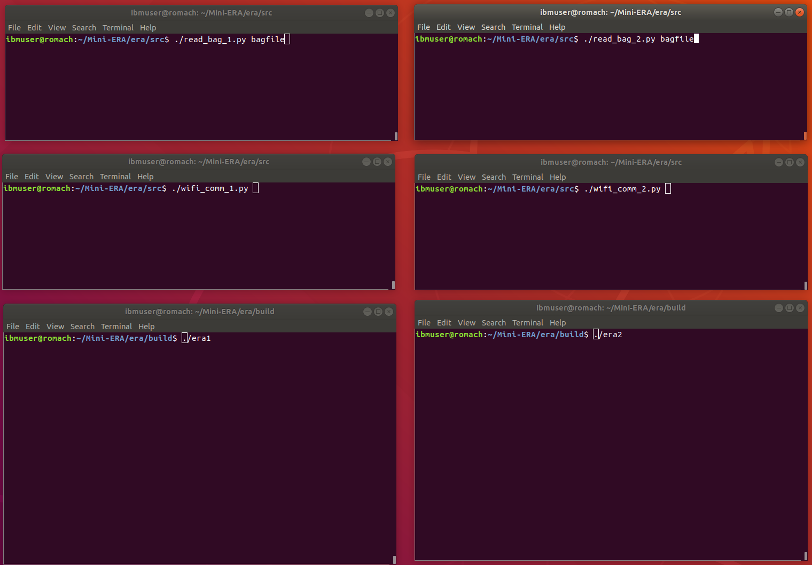

# Standalone-ERA: Demo Version of the Main ERA Workload

Standalone-ERA serves as a standalone version of the workload for _collaborative perception_ in autonomous and semi-autonomous vehicles,
intended to drive the EPOCHS full system design and development methodology through Phase-3 of the
DSSoC Program. Standalone-ERA will serve as the origination workload from which the EPOCHS Phase-3 SoC will be
developed through application of the full suite of EPOCHS domain-specific SoC tools.

This version of Standalone-ERA runs as a standalone program, not requiring a separate autonomous vehicle
simulation infrastructure in order to drive the Standalone-ERA program.  This version is driven by a
"trace" input (taken from a simulator run) that provides the necessary ERA inputs. These inputs are
packaged in a "bagfile" and some example bagfiles are available <a target="_blank" href="https://ibm.box.com/s/nubjzvc7arih5wg74nlfjtczv3vimqv8">here</a>.


## System Requirements

Standalone-ERA has been successfully built and executed using the following set-ups:

 - Ubuntu 18.04 and Python 2.7
 - Ubuntu 20.04 and Python 3.8
 - RHEL 7.9

The bagfiles are in a `rosbag` format, and the Python reader requires that the rosbag package be installed. On Ubuntu, this can be achieved with:

 - Python 2: `sudo apt install python-rosbag -y`
 - Python 3: `sudo apt install python3-rosbag -y`

Other required packakes (mostly used by the computer vision code):

 - Pillow (PIL)
 - Torchvision
 - Pytorch-lightning
 - OpenCV
 - Matplotlib
 - Lightnet


## Installation and Build

Installation is a simple matter of cloning the repository, and then compiling the code using `cmake`:

```
git clone https://github.com/IBM/era.git
cd era
git checkout standalone_era
mkdir build
cd build
cmake ..
make -j
```

Set up the `PYTHONPATH` environment variable to point to the TinyYoloV2/Lightnet Python files:

```
export PYTHONPATH=<your_era_dir>/src/cv/yolo. 
```

Download the ATR and COCO dataset sample weight files for the TinyYoloV2 model from <a href="https://ibm.box.com/s/nha5xih7atsdts9y15t0qwbqlzqv1mln">here</a> into `<your_era_dir>/src/cv/yolo`. At runtime, the TinyYoloV2 model will look for a weight file called `<your_era_dir>/src/cv/yolo/model.weights`, so create a soft link accordingly:

```
cd src/cv/yolo/
ln -s atr.weights model.weights
```

During execution, ERA will consume input (sample) images from `<your_era_dir>/cv_input` and generate output (annotated) images into `<your_era_dir>/cv_output`.


### cmake Targets

At this point, you should have generated two executables file named `era1` and `era2` which are the main ERA executables for this Standalone-ERA version. There are two executables because one is generated for each of the vehicles in the simulation. The bagfile contains data currently for two cars, so we generate the two ERA executables:
 - `era1` : the `hero1` executable, that reads and reacts to the hero1 bagfile contents.
 - `era2` : the `hero2` executable, that reads and reacts to the hero2 bagfile contents.

The bag file can be downloaded from <a href="https://ibm.box.com/s/nubjzvc7arih5wg74nlfjtczv3vimqv8">here</a>.

There are an additional two executables named `do_xmit_pipe` and `do_recv_pipe` which are standalone versions of the transmit and receive pipelines used in the ERA executables. These are useful programs for further development and testing of the specific transmit (xmit) or receive (recv) pipeline implementations.


### cmake Options

There are a number of options included in `CMakeLists.txt`, largely in the form of C MACRO definitions. Some useful ones include:

 - `target_compile_definitions(era1 PRIVATE DEBUG_MODE)` which, if enabled (not commented out) enables DEBUG output.
 - `target_compile_definitions(era1 PRIVATE WRITE_ASCII_MAP)` which, if enabled (not commented out) enables intermediate ASCII gridmap output.
 - `target_compile_definitions(era1 PRIVATE ASCII_FN="asciimap_era1_")` which gives the base name for the ASCII map files.
 - `target_compile_definitions(era1 PRIVATE WRITE_FUSED_MAPS)`  which, if enabled (not commented out) enables intermediate gridmap PPM file output.
 - `target_compile_definitions(era2 PRIVATE IMAGE_FN="gridimage_era1_")` which gives the base name for the gridmap PPM files.

Generally, running with `DEBUG_MODE` puts out **a lot** of information, and lenghtens the run-tmie considerably. The map generation options provide a couple of means to visualize the map fusion process. These results are written to a number of files, one per time-step, which does only affects the run-time slightly.


## Execution

Standalone-ERA execution requires eight simultaneous processes:
 - one process to read the input bagfile for car 1 (`read_bag_1.py`).
 - one process to read the input bagfile for car 2 (`read_bag_2.py`).
 - one process to operate as the WiFi interconnect for car 1 -> car 2 messages (`wifi_comm_1.sh`).
 - one process to operate as the WiFi interconnect for car 2 -> car 1 messages (`wifi_comm_2.sh`).
 - one process to operate as the car 1 target for the final fused maps (`carla_recv_1.sh`).
 - one process to operate as the car 2 target for the final fused maps (`carla_recv_2.sh`).
 - one process to run the ERA workload for car 1 (`era1`).
 - one process to run the ERA workload for car 2 (`era2`).

We provide the following Python script that launches ERA by simultaneously running the eight processes mentioned above:

```
cd era
./launch_era.py [n_steps > 0]
```

`n_steps` is an optional integer argument that indicates the maximun number of iterations to run (if not specified, all the input bagfile is consumed).

The script generates eight output files, corresponding to the eight executed processes, with names: `read_bag_1.out`, `read_bag_2.out`, `wifi_comm_1.out`, `wifi_comm_2.out`, `carla_recvr_1.out`, `carla_recvr_2.out`, `era_1.out`, and `era_2.out`.

The underlying functionality of the eight processes is as follows:

### `read_bag_X.py`

`read_bag_X.py` reads the bagfile and extract the appropriate content for their car (i.e. either the odometry and lidar data for car 1 or 2) and provide it to the ERA program via a socket interface. `read_bag_X.py` implements a socket server (in Python) which listens for a connection from the ERA program, and then uses that connection (held live throughout the run) to transfer the bagfile data to the ERA program. This provides a machine-independent mechanism for reading these large trace files and providing them to a simpler or mroe limited platform (e.g. an FPGA or smaller-memory SoC).

### `wifi_comm_X.sh`
`wifi_comm_X.sh` is really just a shell script that embodies specific command-line parameters for underlying invocations of the `wifi_comm.py` program. The `wifi_comm.py` program will set up a socket server, and listen for the appropriate connections from the ERA programs. The wifi_comm server then acts as a stand-in (substitute) for the over-air transmission of the WiFi data, allowing the two cars (embodied in the ERA programs) to communicate their shared messages/data.

The `wifi_comm.py` program implements a "receiver" channel (socket) and a "transceiver" channel (socket) to take transmitted data from one car and provide it to the other car. At present, this only supports the 2-car initial system, and does not support broadcast communication (future work). Similarly, this operates in a "time-step" fully deterministic (and reproducible) manner, to provide consistency in the test environment.

### `carla_recvr_X.sh`
`carla_recvr_X.sh` is really just a shell script that embodies specific command-line parameters for underlying invocations of the `carla_recvr.py` program. The `carla_recvr.py` program will set up a socket server, and listen for the appropriate connections from the ERA programs. The carla_recvr server then acts as a stand-in (substitute) for the car itself which would receive back the fused gridmaps. At present, we are simulating the cars using the CARLA simulator (though other simulation platforms are also possible), hence the name.

The `carla_recvr.py` program implements a "receiver" channel (socket) which provides a means to send the data from the ERA hardware (doing the intercommunication
and cooperative intelligence aspects) and return the resulting learned data (in this case the fused occupancy gridmap) back to the car in the CARLA environment. At present we only model a 2-car system, but this can easily be expanded.

### `eraX`
The ERA programs are the target workload, compiled from the underlying C source code, and represent the ERA functionality added to an underlying vehicle. The two programs (`era1` and `era2`) are identical, but for some compile-time assignments of TCP ports (for the sockets) and such. In practice, each program will, however, be driven by different content from within the bagfiles, and thus the execution profiles can vary according to the environment, actions, etc. of the cars as described in their bagfiles.


### Alternative Execution Approach

Alternatively (i.e. not relying on the `launch_era.py` script), it is possible to invoke/execute ERA by setting up **eight terminal windows**, and invoking the related processes in each window. It is recommended to start the bagfiles and WiFi interconnect (socket server) processes before invocation of either the `era1` or `era2` program. A possible environment for this is illustrated below.

<p align="center"></p>


Assuming a bagfile named `bagfile` and placed in `era/data`:

**Terminal 1:**

```
cd era/src
python ./read_bag_1.py ../data/bagfile
```

**Terminal 2:**

```
cd era/src
python ./read_bag_2.py ../data/bagfile
```

**Terminal 3:**

```
cd era/src
./wifi_comm_1.sh
```

**Terminal 4:**

```
cd era/src
./wifi_comm_2.sh
```

**Terminal 5:**

```
cd era/src
./carla_recvr_1.sh
```

**Terminal 6:**

```
cd era/src
./carla_recvr_2.sh
```

**Terminal 7:**

```
cd era/build
./era1
```

**Terminal 8:**

```
cd era/build
./era2
```

At this point, you will have invoked the Standalone-ERA program for the two cars and driven it with your bagfile.  


## Contacts and Current Maintainers

 - J-D Wellman (wellman@us.ibm.com)
 - Augusto Vega (ajvega@us.ibm.com)
 
