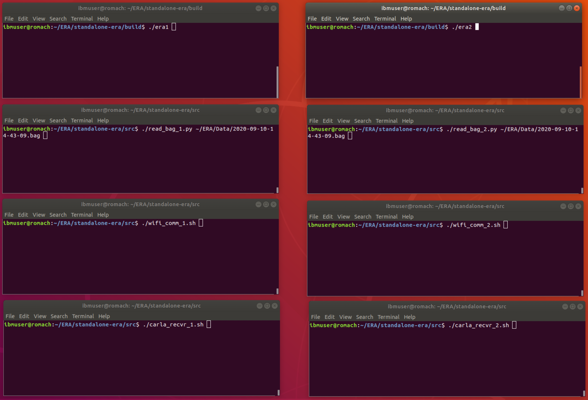

# Standalone-ERA: Demo Version of the Main ERA Workload

The Demo-ERA serves as a stand-alone version of the workload for Colaborative Autonomous Vehicles,
intended to drive the EPOCHS full system design and development methodology through Phase-2 of the
DSSoC Program. The Demo-ERA will serve as the origination workload from which the EPOCHS Phase-2 SoC will be
developed through application of the full suite of EPOCHS Domain-Specific SoC tools.

This version of Demo-ERA runs as a standalone program, not requiring a separate autonomous vehicle
simulation infrastructure in order to drive the Deom-ERA program.  This version is driven by a
"trace" input (taken from a simulator run) that provides the necessary ERA inputs.  These inputs are
packaged in a "bagfile" and some example bagfiles can be made available (but they are quite
large and not included in the baseline github repository).

## System Requirements

Demo-ERA has been successfully built and executed using the following set-up:
 - Ubuntu 18.04
 - Python 2.7

The bagfiles (see below) are in a ```rosbag``` format, and the python reader requires that the
rosbag package be installed.  On Ubuntu 18, this can be achieved with
```
sudo apt install python-rosbag -y
```


## Installation and Build

Installation is a simple matter of cloning the repository, and then
compiling the code using cmake.

```
git clone https://github.com/IBM/era/tree/standalone_era
cd era
mkdir build
cd build
cmake ..
make
```

At this point, you should have generated two executables file named ```eraX```
which are the main ERA executables for this Demo-ERA version.  There are two
executables because one is generated for each of the Autonomous Vehicles (cars)
in the simulation.  The bagfile contains data currently for two AVs, so we generate the
two ERA executables:
 - era1 : the ```hero1``` executable, that reads and reacts to the hero1 bagfile contents
 - era2 : the ```hero2``` executable, that reads and reacts to the hero2 bagfile contents

The bag file can be downloaded at: https://ibm.box.com/s/2ji8jljguz3wgyovaxfs4m6v9vyjtwfk

## Execution

To execute the Demo-ERA program requires six simultaneous processes:
 - one process to read the input bagfile for AV 1 (```read_bag_1.py```)
 - one process to read the input bagfile for AV 2 (```read_bag_2.py```)
 - one process to run the ERA (swarming) workload for AV 1 (```wifi_comm_1.sh```)
 - one process to run the ERA (swarming) workload for AV 2 (```wifi_comm_2.sh```)
 - one process to operate as the WiFi interconnect for AV 1 -> AV 2 messages (```era1```)
 - one process to operate as the WiFi interconnect for AV 2 -> AV 1 messages (```era2```)

The simplest method (currently) to invoke/execute ERA is therefore to set up
six terminal windows, and to invoke the related processes in each window.
It is recommended that one start the bagfiles and WiFi interconnect (socket server)
processes before invocation of either the ```era1``` or ```era2``` program.
A possible environment for this is illustrated below.
<p align="center"></p>

The underlying function is as follows
### ```read_bag_X.py```
 The read_bag programs will read the bagfile and extract the appropriate content for their AV
 (i.e. either the odometry and lidar data for Autonomous Vehicle 1 or 2) and provide it to
 the era program via a socket interface.  The read_bag implements a socket server (in python) which
 listens for a connection from the era program, and then uses that connection (held live throughout
 the run) to transfer the bagfile data to the era program.  This provides a machine-independent
 mechanism for reading these large trace files and providing them to a simpler or mroe limited
 platform (e.g. an FPGA or smaller-memory SoC).

### ```wifi_comm_X.sh```
 The wifi_comm programs are really just shell-scripts that embody specific (command-line)
 parameters for underlying invocations of the ```wifi_comm.py``` program.  The
 ```wifi_comm.py``` program will set up a socket server, and listen for the appropriate
 connections from the era programs.  The wifi_comm server then acts as a stand-in (substitute)
 for the over-air transmission of the WiFi data, allowing the two AVs
 (embodied in the era programs) to communicate their shared messages/data.

The ```wifi_comm.py``` program implements a "receiver" channel (socket) and a "transmission" channel
(socket) which provides them the means to take tranmitted data from one AV and provide it to the
other AV.  At present this only supports the 2-AV initial system, and does not provide for broadcast
communications, which may be future work.  Similarly, this operates in a "time-step" fully
deterministic (and reproducible) manner, to provide consistency in the test environment, etc.

### ```eraX```
The era programs are the target workload, compiled from the underlying C source code, and
represent the ERA functionality added to an underlying Autonomous Vehicle.  The
two programs are identical, but for some compile-time assignments of TCP ports (for the
sockets) and such.  In practice, each program will, however, be driven by different content
from within the bagfile, and thus the execution profile can vary according to the environment,
actions, etc. of that AV as described in that bagfile.

### Recap

The easiest way to run the standalone Demo-ERA is to start multiple (six) terminals in pairs,
and in one pair to invoke the bagfile reader/publisher for each AV, in another pair
to start eh wifi-communications proxy for each AV, 
and then in the last to start the ERA executables.

To do this, first obtain a bagfile, which we will assume is named ```bagfile``` and stored in
```era/data```.  Activate one pair of terminals, and in one type

```
cd era/src
python ./read_bagfile_1.py ../data/bagfile
```
and in the other type
```
cd era/src
python ./read_bagfile_2.py ../data/bagfile
```

Now activate a second pair of terminals, and type
```
cd era/src
python ./wifi_comm_1.py
```
and in the other
```
cd era/src
python ./wifi_comm_2.py
```

Now activate a third pair of terminals, and type in one
```
cd era/build
./era1
```
and in the other
```
cd era/build
./era2
```

At this point, you will have invoked the standalone Demo-ERA program for
the two AVs and driven it with your bagfile.  

### Usage

Currently, the standalone Demo-ERA program does not support command-line options, etc.
As such, there is very little to the usage at this point -- please refer to the ```Execution```
section above.


## Contacts and Current Maintainers

 - Akin Sisbot (easisbot@us.ibm.com)
 - J-D Wellman (wellman@us.ibm.com)
 - Augusto Vega (ajvega@us.ibm.com)
 
